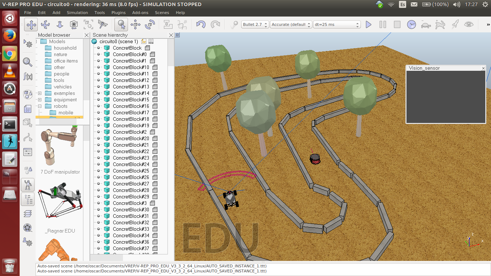
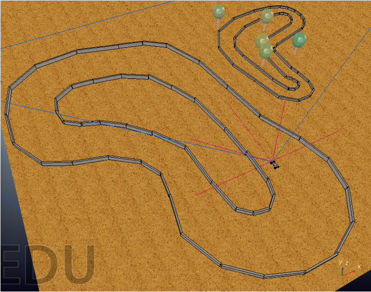
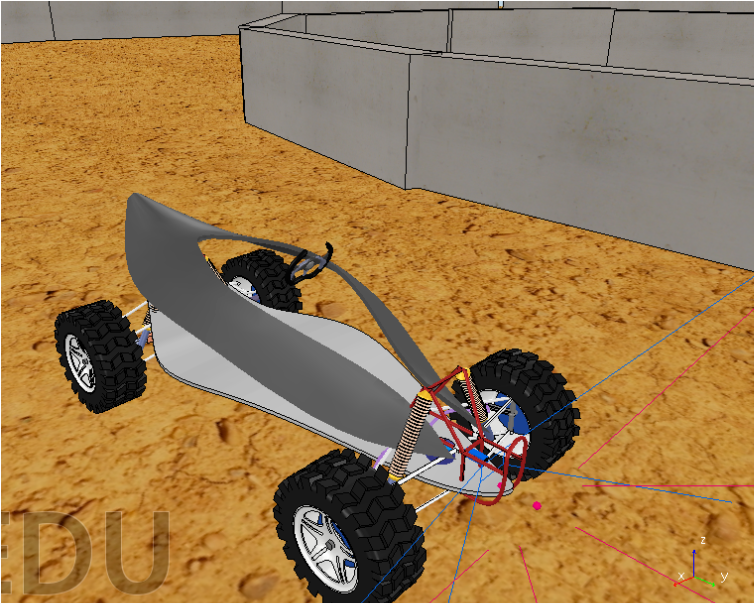
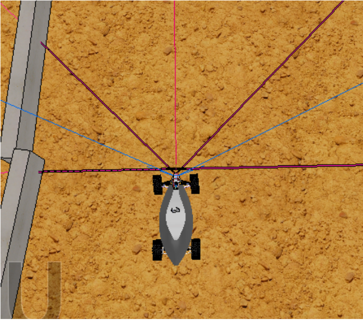

# VIL = Vehicle Intelligent Learning

Mediante este trabajo se ha logrado mediante simulación que un vehículo sea capaz de trazar el recorrido de un circuito.

Como podemos ver, para conseguir hacer las simulación hemos usado el simulador de robótica de V-Rep.

El simulador de robótica V-REP dispone de una interfaz o entorno de desarrollo (IDE) en la que cada modelo u objeto está basado en una arquitectura de control distribuido (puede ser controlado por un script propio, un plugin, una aplicación cliente remota a través de su API, un nodo ROS (Robot Operative System) etc). Esto hace ideal a la plataforma de simulación en un entorno multi-robot.

V-REP se usa para el desarrollo rápido de algoritmos, simulación de automatización en fábricas, para prototipádo rápido y verificación, enseñanza de la robótica, etc. V-REP es multi-plataforma, y permite la creación de contenido portable, escalable y de fácil mantenimiento: un simple fichero portable puede contener un modelo funcional completo (o escena), incluyendo código de control.

## Manta y el problema

El problema en cuestión consiste en tratar un vehículo como si de un coche de carreras autodirigido se tratara. La idea inicial consistía en crear más de un circuito, entrenar el vehículo en alguno de ellos y ver cómo se comportaba al cambiar de circuito. Para crear el recorrido se han utilizado bloques que son facilitados por V-REP, colocándolos en diferentes posiciones y diferentes ángulos para crear el circuito.

Buscamos un vehículo que encuentre la forma de conducir más óptima para recorrer un circuito. V-REP nos facilita modelos de más de un vehículo, tales como coches, tanques, aviones, etc. En nuestro caso hemos seleccionado el vehículo de cuatro ruedas Manta. Tal y como puede verse en la imagen 3, el vehículo cuenta con cuatro ruedas además de amortiguadores y una estructura; por lo demás, el vehículo no cuenta con ninguna funcionalidad extra a parte de las que nosotros añadamos.

### Sensores

Hay dos tipos de percepciones: aquellas que reflejan el estado del entorno (percepciones externas) y las que reflejan el estado del robot (percepciones internas); en nuestro caso del vehículo.

Como percepciones externas, hemos puesto varios sensores de proximidad en la parte delantera del vehículo con diferentes direcciones; son cinco sensores, dos que apuntan uno a cada lado en ángulo recto, otro mirando al frente y los otros dos en un punto intermedio entre los anteriores (a 45 grados). Los sensores de proximidad que tenemos ofrecen dos tipos de información: por una parte, si hay alguna interferencia en su rango de alcance (en caso de que la haya), la distancia a la que se encuentra el objeto más próximo en esa dirección y, por otra parte, la normal del plano del objeto que el sensor percibe. El alcance de todos los sensores es el mismo: 8 metros.

